# SAR Narrative Generator — System Diagrams & Architecture

> **For:** Hackathon PPT & Submission Document  
> **Project:** AI-powered Suspicious Activity Report Generator  
> **Team:** Shubh · Dev · Siddh · Het · Sakshi

---

## 1. High-Level System Architecture

> **Slide caption:** "Four-layer architecture separating presentation, orchestration, AI intelligence, and data."

### Layer Breakdown (for slide annotations)

| Layer | Components | Tech Stack | Purpose |
|-------|-----------|------------|---------|
| **Presentation** | Streamlit UI (4 pages), API Client | Streamlit, Requests | User interaction — upload data, view/edit SARs, review audit trail |
| **Orchestration** | FastAPI, Route Controller | FastAPI, Pydantic, Uvicorn | API gateway — validates requests, routes to AI modules, returns structured JSON |
| **AI Intelligence** | LLM Engine, RAG Pipeline, Typology Classifier, Audit Logger | Ollama, LangChain, ChromaDB, XGBoost, SHAP | Core AI — generates narratives, retrieves regulatory context, classifies typology, logs reasoning |
| **Data & Storage** | Data Parser, Knowledge Base, In-Memory Store | Pandas, ChromaDB, PostgreSQL (Docker) | Data ingestion, normalization, vector storage, persistent storage |

---

## 2. User Flow Diagram

> **Slide caption:** "End-to-end analyst workflow — from uploading suspicious transaction data to filing an approved SAR."

```mermaid
flowchart TD
    START(["👤 Compliance Analyst<br/>opens SAR Generator"]) --> DASH["📊 Dashboard<br/>View active cases, metrics,<br/>system status"]
    
    DASH --> UPLOAD["📥 Upload Transaction Data<br/>CSV or JSON file<br/>(alerts + KYC data)"]
    
    UPLOAD --> PREVIEW["👀 Preview Data<br/>Analyst reviews parsed<br/>transactions in table"]
    
    PREVIEW --> GENERATE["🤖 Click 'Generate SAR'<br/>Triggers AI pipeline"]
    
    GENERATE --> PIPELINE["⚙️ AI Processing<br/>~45 seconds"]
    
    subgraph PIPELINE_DETAIL["AI Pipeline Steps"]
        direction TB
        P1["1️⃣ Data Analyst Agent<br/>Pattern detection"]
        P2["2️⃣ Compliance Mapper<br/>Typology classification"]
        P3["3️⃣ RAG Retriever<br/>Fetch regulatory context"]
        P4["4️⃣ Narrator Agent<br/>Generate SAR narrative"]
        P5["5️⃣ QA Validator<br/>Score completeness"]
        P1 --> P2 --> P3 --> P4 --> P5
    end
    
    PIPELINE --> PIPELINE_DETAIL
    PIPELINE_DETAIL --> EDITOR["📝 SAR Editor<br/>Split-screen view:<br/>data left · narrative right"]
    
    EDITOR --> REVIEW{{"🔍 Analyst Review"}}
    
    REVIEW -->|"Needs changes"| EDIT["✏️ Edit Narrative<br/>Modify intro/body/conclusion<br/>(diff tracked in audit trail)"]
    EDIT --> REVIEW
    
    REVIEW -->|"Looks good"| AUDIT["🔍 Review Audit Trail<br/>Expandable step cards<br/>with confidence scores"]
    
    AUDIT --> DECISION{{"Approve?"}}
    
    DECISION -->|"✅ Approve"| APPROVED["✅ SAR Approved<br/>Status → Approved<br/>Ready for FinCEN filing"]
    DECISION -->|"❌ Reject"| EDIT
    
    APPROVED --> EXPORT["📤 Export<br/>Download SAR document<br/>for regulatory submission"]

    style START fill:#667eea,stroke:#667eea,color:#fff
    style APPROVED fill:#064e3b,stroke:#34d399,color:#34d399
    style PIPELINE_DETAIL fill:#1a1a2e,stroke:#764ba2,color:#c9d1d9
```

---

## 3. Data Flow / Sequence Diagram

> **Slide caption:** "Request lifecycle — how data flows through every component during SAR generation."

```mermaid
sequenceDiagram
    actor Analyst as 👤 Analyst
    participant FE as 🖥️ Streamlit UI
    participant API as ⚙️ FastAPI
    participant DP as 📄 Data Parser
    participant ML as 🧮 XGBoost Classifier
    participant LLM as 🧠 LLM Engine
    participant RAG as 📚 RAG Pipeline
    participant CB as 🗄️ ChromaDB
    participant OL as 🦙 Ollama (Llama 3.1)
    participant AL as 📋 Audit Logger

    Note over Analyst,AL: PHASE 1 — Upload & Parse

    Analyst->>FE: Upload CSV/JSON file
    FE->>API: POST /api/upload (multipart)
    API->>DP: parse_file(content, filename)
    DP-->>API: { case_id, transactions[], customer }
    API-->>FE: UploadResponse (case_id, txn_count)
    FE-->>Analyst: ✅ "21 transactions parsed"

    Note over Analyst,AL: PHASE 2 — Generate SAR Narrative

    Analyst->>FE: Click "Generate SAR"
    FE->>API: POST /api/generate-sar { case_id }
    
    API->>ML: predict(transactions)
    ML-->>API: { typology: "structuring", confidence: 0.92 }
    
    API->>LLM: generate_sar(case_data)
    activate LLM
    LLM->>AL: log_step(1, "Started SAR Generation")
    LLM->>RAG: retrieve_context(query)
    RAG->>CB: similarity_search(query, k=5)
    CB-->>RAG: [relevant FinCEN docs]
    RAG-->>LLM: [regulatory context]
    LLM->>AL: log_step(2, "Context Retrieved")
    LLM->>OL: ChatOllama.ainvoke(prompt)
    OL-->>LLM: Generated SAR narrative text
    LLM->>AL: log_step(3, "Narrative Generated")
    LLM-->>API: { narrative, audit_trail, quality_score }
    deactivate LLM
    
    API-->>FE: SARResponse (full JSON)
    FE-->>Analyst: 🎉 SAR ready in Editor!

    Note over Analyst,AL: PHASE 3 — Review, Edit, Approve

    Analyst->>FE: Edit narrative sections
    FE->>API: PUT /api/sar/{id} { narrative }
    API->>AL: AuditStep("analyst edit — body edited")
    API-->>FE: Updated SAR (status: review)
    
    Analyst->>FE: Click "Approve"
    FE->>API: POST /api/sar/{id}/approve
    API->>AL: AuditStep("SAR approved for filing")
    API-->>FE: { status: "approved" ✅ }
```

---

## 4. Component / Module Diagram

> **Slide caption:** "How each file maps to a responsibility — zero-conflict ownership across the team."

---

## 5. API Endpoint Map

> **Slide caption:** "RESTful API — 7 endpoints covering the full SAR lifecycle."

| Method | Endpoint | Purpose | Request | Response |
|--------|----------|---------|---------|----------|
| `POST` | `/api/upload` | Upload transaction CSV/JSON | `multipart/form-data` (file) | `{ case_id, txn_count, customer_name }` |
| `POST` | `/api/generate-sar` | Generate AI narrative | `{ case_id }` | `SARResponse` (narrative + audit + quality + typology) |
| `GET` | `/api/sar/{id}` | Retrieve SAR by ID | — | `SARResponse` |
| `PUT` | `/api/sar/{id}` | Edit narrative (diff tracked) | `{ narrative: { intro, body, conclusion } }` | Updated `SARResponse` |
| `POST` | `/api/sar/{id}/approve` | Approve SAR for filing | — | `{ status: "approved" }` |
| `GET` | `/api/cases` | List all uploaded cases | — | `{ cases: [...], total }` |
| `GET` | `/api/audit/{id}` | Get full audit trail | — | `{ audit_trail: [ steps... ] }` |

---

## 6. AI Pipeline Detail

> **Slide caption:** "Multi-agent AI pipeline — 5 specialized agents process every SAR with full audit trail."

```mermaid
flowchart LR
    INPUT["📥 Input<br/>Transaction Data<br/>+ KYC Profile"] --> A1

    subgraph AGENTS["Multi-Agent AI Pipeline"]
        direction LR
        A1["🔍 Data Analyst<br/>Agent"]
        A2["📋 Compliance<br/>Mapper Agent"]
        A3["📖 RAG Context<br/>Retriever"]
        A4["✍️ Narrator<br/>Agent"]
        A5["✅ QA Validator<br/>Agent"]
        A1 -->|"patterns<br/>anomalies"| A2
        A2 -->|"typology<br/>regulations"| A3
        A3 -->|"templates<br/>guidance"| A4
        A4 -->|"draft<br/>narrative"| A5
    end

    A5 --> OUTPUT["📄 Output<br/>SAR Narrative<br/>+ Audit Trail<br/>+ Quality Score"]
    
    A1 -.- D1["Inputs: 21 transactions<br/>Outputs: 16.7x volume spike detected"]
    A2 -.- D2["Matched: FinCEN Advisory,<br/>RBI Sec 14.2, FATF #23"]
    A3 -.- D3["Retrieved: SAR Template T-005,<br/>Similar case 89% match"]
    A4 -.- D4["Generated: 5Ws+How narrative<br/>847 words, FinCEN format"]
    A5 -.- D5["Score: Completeness 95%<br/>Compliance 98%"]

    style AGENTS fill:#1a1a2e,stroke:#764ba2,stroke-width:2px,color:#c9d1d9
    style INPUT fill:#0d1117,stroke:#667eea,color:#c9d1d9
    style OUTPUT fill:#064e3b,stroke:#34d399,color:#34d399
```

---

## 7. Technology Stack Diagram

> **Slide caption:** "Production-grade stack — every component chosen for reliability, scalability, and compliance."

| Category | Technology | Why We Chose It |
|----------|-----------|----------------|
| **LLM** | Ollama + Llama 3.1 8B | Fully local — no API keys, no data leakage, runs on 8GB RAM |
| **RAG** | ChromaDB + LangChain | Vector similarity search over FinCEN docs for context-aware generation |
| **ML** | XGBoost + SHAP | High-accuracy typology classification with explainable feature importance |
| **Backend** | FastAPI + Pydantic | Async, auto-validated schemas, OpenAPI docs out of the box |
| **Frontend** | Streamlit | Rapid prototyping, built-in data widgets, zero JS needed |
| **Infra** | Docker Compose | One-command stack deployment: `docker-compose up` |
| **DB** | PostgreSQL 16 | Production-grade persistent storage (in-memory for prototype) |

---

## 8. SAR Lifecycle State Diagram

> **Slide caption:** "Every SAR goes through a tracked lifecycle — with full audit trail at every transition."

---

## 9. Key Differentiators (for "Why We're Better" slide)

| Feature | Our System | Traditional SAR Tools |
|---------|-----------|----------------------|
| **AI Generation** | Llama 3.1 generates FinCEN-compliant narrative in ~45s | Manual drafting takes 2–4 hours |
| **Full Audit Trail** | Every AI reasoning step logged with data provenance | No transparency into how narrative was created |
| **Explainability** | SHAP feature importance shows WHY a typology was flagged | Black-box classification |
| **Privacy** | 100% local — Ollama runs on-premise, zero data leaves the bank | Cloud APIs = data leakage risk |
| **RAG Context** | Retrieves relevant FinCEN guidance + past SAR templates | Analyst must manually look up regulations |
| **Quality Scoring** | Automated: completeness, compliance, readability, evidence linkage | Subjective peer review |
| **Human-in-the-Loop** | Analyst reviews, edits (diff tracked), and approves before filing | Either fully manual or fully automated |
